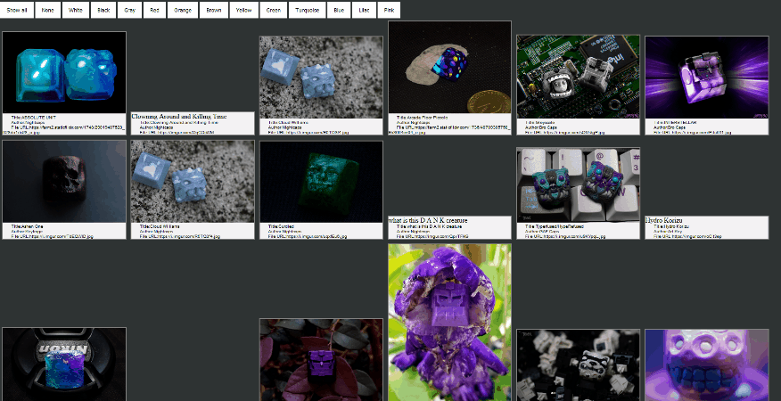

# Artisan Keycap Website
This is a website hosting artisan keycap images that can be filtered by color. The web scraper pulls data from the subreddit /r/artisanmacro, processes the images for colors, and applies tags for filtering.  

Checkout the [project plan](project_plan.md) documentation for additional info.  
Checkout the [log](build_log.md) for day by day notes.  
TBD lessons learned and closeout documents

  


## Installation
Debian 9 (stretch):
Install docker, this method is not recommended for production.
```bash
curl -fsSL https://get.docker.com -o get-docker.sh
sh get-docker.sh
```
Clone this repository using git.
```bash
apt-get install git
git clone https://github.com/jonmurphy1618/artisan.git
cd artisan
```

## Usage
The following command will launch the scraper and host as a docker background process.  
`./manage.sh update`  
The update command will scrape posts from urls provided in `artisan/artisan/spiders/app.py` 
and save the output data to `artisan/output/test.json` & images to `artisan/output/full/`.  

After the webscape is done. The `colorscan.py` script is called which processed the images for colorvalues
and appends the data to `test.json`.  

`./manage.sh webhost`  
The webhost command activates a Caddy local webhost on port 2019.

#### Tweaking Results
The threshold for an image being showing under a color tab can be adjusted.
Open `nano ./webhost/www/script.js` and edit `var color_cutoff = 100;`. Higher values are more strict.  

Image sources can be added or removed from the scraper.  
Open `nano ./artisan/spiders/app.py` and edit `start_urls = [<url>]`. `<url>` is the full http reddit web address.

## Dependencies
- Docker
- PyPy
- Scrapy
- PIL
- Caddy

## License
This project is licensed under the MIT License. All dependencies are forms of open-source licensing.
- Docker is Apache 2.0 [link][1]
- PyPy is MIT [link][2]
- Scrapy is BSD-3-Clause [link][3]
- PIL is MIT-like [link][4]
- Caddy is Apache [link][5]

[1]:https://github.com/moby/moby/blob/master/LICENSE
[2]:https://bitbucket.org/pypy/pypy/src/default/LICENSE
[3]:https://github.com/scrapy/scrapy/blob/master/LICENSE
[4]:http://www.pythonware.com/products/pil/license.htm
[5]:https://github.com/caddyserver/caddy/blob/master/LICENSE.txt
